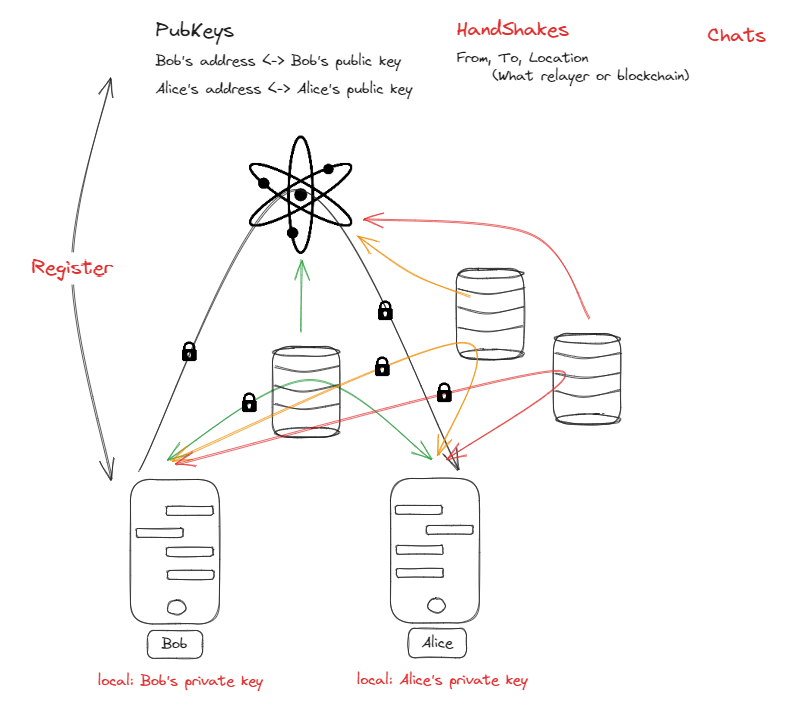

# Eywa-relayer

## Architecture of using eywa-relayer


Follow above diagram, The Eywa-relayer is a standalone application that listens to Eywa-clients relays between them for fast and secure communication. Also, the main feature of this eywa-relayer is to copy and broadcast messages to Cosmos network with transactions.

## Scalability



Eywa-relayer has been designed with scalability in mind. Anyone can run their own eywa-relayer server and connect to the Eywa network. This means that the Eywa network can scale to support a large number of users and applications. It also means that the Eywa network is not dependent on any single entity to operate and cannot be shut down by any single entity. It's also that ewya system can be a public chat system beacuse anyone can run their own eywa-relayer server and everyone can access the eywa data.

## Security

Follow the link to see the security of the Eywa network.

you can see the security of the Eywa network in the how Eywa works section which on the link below.
[🔐Security](https://github.com/eywa-foundation/eywa)

## Installation

### Using Docker

You must set docker environment variables before running eywa-relayer. Which is `ACCOUNT_NAME` , `NODE_ADDRESS` and `MNEMONIC`. recommended values are `alice` and `http://node.celestia.eywa.jaehong21.com:26657` respectively.

> ⚠️ Warning: This is not safe, but it's just a demo! You must set "MNEMONIC" properly that is knwon to ignite chain

```bash
docker pull jaehong21/eywa-relayer:latest
```
